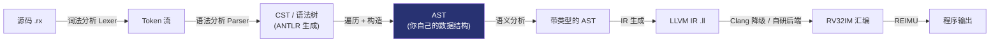

Optimized tool selection我先来仔细阅读这个仓库的内容。

Read 

Read 

Read 

Read 

Read 

Read 

Read , lines 1 to 400

Read , lines 1 to 300

Read , lines 400 to 698

Read , lines 1 to 150

Read 

Read 

Read 

Read 

Read 

Ran terminal command:  cat /home/kai/ACM_class_project/rx-compiler/.gitmodules 2>/dev/null; echo "---"; cd /home/kai/ACM_class_project/rx-compiler && git submodule status 2>/dev/null; echo "---"; ls vendor/REIMU 2>/dev/null | head -30


Fetched https://acmclasscourse-2025.github.io/rx-compiler-specification/

Fetched https://github.com/ACMClassCourse-2025/rx-compiler-testcases


Fetched https://acmclasscourse-2025.github.io/rx-compiler-specification/grammar.html

Fetched https://api.github.com/repos/ACMClassCourse-2025/rx-compiler-testcases/git/trees/main?recursive=0


Fetched 2 resources


Fetched https://api.github.com/repos/ACMClassCourse-2025/rx-compiler-testcases/git/trees/master?recursive=1


Fetched https://raw.githubusercontent.com/ACMClassCourse-2025/rx-compiler-testcases/master/README-EN.md

Ran terminal command:  cd /home/kai/ACM_class_project/rx-compiler && grep -n "lex\|parse\|MANIFEST_STAGES\|skip" scripts/test.py | head -40; echo "===="; ls -a; echo "===="; ls .github/workflows 2>/dev/null


Fetched 2 resources


Fetched https://raw.githubusercontent.com/ACMClassCourse-2025/rx-compiler-testcases/master/parser/manifest.json

我需要确认官方测试用例里 parser 用例的期望结果到底怎么标注，让我直接分析一下官方 manifest（只读取到终端，不写任何文件）：

Ran terminal command:  cd /tmp && curl -s https://raw.githubusercontent.com/ACMClassCourse-2025/rx-compiler-testcases/master/parser/manifest.json -o rx_parser_manifest.json && curl -s https://raw.githubusercontent.com/ACMClassCourse-2025/rx-compiler-testcases/master/lexer/manifest.json -o rx_lexer_manifest.json && python3 - <<'EOF'
import json, collections
for name in ("rx_parser_manifest.json", "rx_lexer_manifest.json"):
    data = json.load(open(name))
    print("==", name, "entries:", len(data))
    print("stages:", collections.Counter(e.get("stage") for e in data))
    print("success:", collections.Counter(bool(e.get("compilation_success")) for e in data))
    # 看几个关键源文件名的期望
    keys = ("mod_item", "enums", "match_expr", "extern", "range_forms", "frontmatter")
    for e in data:
        src = e.get("source", "")
        if any(k in src for k in keys):
            print(f'  {e.get("stage")} succ={e.get("compilation_success")} {src}  desc={e.get("description","")[:60]}')
EOF

Ran terminal command:  cd /tmp && base=https://raw.githubusercontent.com/ACMClassCourse-2025/rx-compiler-testcases/master/parser && for f in "accept/0008_mod_item-4c0301505b.rx" "accept/0008_mod_item-cfa7bda9e0.rx" "accept/0019_enums-d8b5b5b04c.rx" "accept/match_expr-d9e5635c30.rx" "accept/0031_extern-266cf263bb.rx" "reject/0000_struct_field_missing_comma-9b86c624ce.rx" "reject/empty_param_slot-ac8f2f25d3.rx"; do echo "===== $f"; curl -s "$base/$f"; echo; done


Fetched 2 resources

Ran terminal command:  cd /tmp && python3 - <<'EOF'
import json
for name in ("rx_parser_manifest.json", "rx_lexer_manifest.json"):
    data = json.load(open(name))
    print("=====", name)
    for e in data[:6]:
        print(json.dumps(e, ensure_ascii=False)[:400])
    print("--- 特殊条目 ---")
    for key in ("0001_struct_item", "reject/empty_param_slot", "reject/unclosed_block_comment_at_eof", "reject/numbers-98101fae27"):
        for e in data:
            if key in e.get("source",""):
                print(json.dumps(e, ensure_ascii=False)[:600])
EOF

Ran terminal command:  cd /tmp && python3 - <<'EOF'
import json, collections
data = json.load(open("rx_parser_manifest.json"))
by_entry = collections.defaultdict(lambda: collections.Counter())
for e in data:
    entry = (e.get("metadata") or {}).get("entry", "<none>")
    by_entry[entry][bool(e["compilation_success"])] += 1
print("parser 用例按 entry 规则统计 (entry: 通过数/拒绝数):")
for k, c in sorted(by_entry.items()):
    print(f"  {k}: ok={c[True]} reject={c[False]}")
print()
print("=== accept 中 entry 非 crate 的样例 ===")
n = 0
for e in data:
    m = e.get("metadata") or {}
    if e["compilation_success"] and m.get("entry") != "crate":
        print(f'  entry={m.get("entry")} src={e["source"]} content={open("/dev/null") if False else ""}')
        print("     >>>", repr(open("rx_parser_manifest.json").read() and ""))
        n += 1
        if n >= 8: break
EOF
# 打印这些样例文件的真实内容
base=https://raw.githubusercontent.com/ACMClassCourse-2025/rx-compiler-testcases/master/parser
for f in "accept/0019_enums-d8b5b5b04c.rx" "accept/match_expr-d9e5635c30.rx" "accept/0031_extern-266cf263bb.rx" "accept/0001_struct_item-161ad2b053.rx"; do :; done
python3 - <<'EOF'
import json
data = json.load(open("/tmp/rx_parser_manifest.json"))
shown = 0
for e in data:
    m = e.get("metadata") or {}
    if e["compilation_success"] and m.get("entry") != "crate":
        print(" ", m.get("entry"), "|", e["source"])
        shown += 1
        if shown >= 25: break
EOF

Ran terminal command:  cd /tmp && python3 - <<'EOF'
import json, collections
data = json.load(open("rx_lexer_manifest.json"))
keys = collections.Counter()
entries = collections.Counter()
for e in data:
    m = e.get("metadata") or {}
    keys.update(m.keys())
    entries[m.get("entry")] += 1
print("lexer metadata 字段分布:", dict(keys))
print("lexer entry 分布:", dict(entries))
print()
print("示例 accept 条目 metadata:", json.dumps(data[1]["metadata"], ensure_ascii=False)[:700])
print()
print("示例 reject 条目:", json.dumps(data[-1], ensure_ascii=False)[:500])
# 检查 parser reject 中 entry 分布
p = json.load(open("rx_parser_manifest.json"))
rej = collections.Counter()
for e in p:
    if not e["compilation_success"]:
        rej[(e.get("metadata") or {}).get("entry")] += 1
print()
print("parser reject entry 分布:", dict(rej))
EOF

Created memory file 

我已经把仓库、子模块里官方用例的 manifest、规范书都读了一遍。下面是给你的完整回答。

---

# 一、这个仓库是什么

这是 **ACM Class 2025 编译器课程（Rx Compiler）的工程模板**。你要写的编译器：

- **输入语言**：Rx —— Rust 的一个子集（函数、命名字段结构体、常量、固有 impl、整数/布尔/定长数组/引用、`Box`/`Vec`、`if`/`while`/`loop`/`return`/`break`/`continue`、`derive(Copy/Clone/PartialEq/Eq)`）。
- **最终目标**：RV32IM 汇编，中间表示必须用 **LLVM IR**（可先输出 `.ll` 文本交给 Clang 验证）。
- **运行环境**：REIMU 模拟器（裸机 RV32，从全局 `main` 开始执行，提供 libc 级 I/O）。
- **实现语言任意**：仓库是语言无关的，测试框架只通过命令行调用你的编译器。

# 二、仓库给你提供了什么（逐项）

| 路径 | 内容 | 对你的价值 | 现在就要用吗 |
|---|---|---|---|
| `Lexer.g4`、`Parser.g4` | Rx 的完整 ANTLR 4.13.2 文法 | **课程明确允许直接用它自动生成词法/语法分析器，"从 AST 开始写"**，这是你两天计划的最大杠杆 | ✅ 核心 |
| `official`（git 子模块） | 官方测试用例：`lexer/`（53 例：30 通过 / 23 拒绝）、`parser/`（442 例：365 通过 / 77 拒绝）、`semantic/`、`codegen/`、`optimization/` | 你的自测标准 | ✅ 核心 |
| `spec/`（git 子模块） | 课程规范书源码，与在线版 [rx-compiler-specification](https://acmclasscourse-2025.github.io/rx-compiler-specification/) 同源 | 语法/语义权威文档 | ✅ 阅读 |
| `Makefile` + `config.mk` + `test.py` | 统一测试入口：你填 `BUILD/SEMANTIC/IR/CODEGEN/RUN` 五条命令，runner 读 `manifest.json` 自动跑全部用例 | 后期 semantic/codegen 阶段的跑分入口 | ⚠️ 部分用 |
| `rx` + `REFERENCE_RUSTC` | 参考实现辅助：默认用 rustc + 一个支持库（`core.rs` 里封装了 REIMU 的 `printf/scanf`）把整条流水线先跑通 | 让你在还没写编译器时就能验收测试框架；**不是你的编译器骨架** | ❌ 暂不用 |
| `REIMU` | RISC-V 模拟器（子模块，要用 xmake 单独编译） | 以后 codegen 阶段跑汇编 | ❌ 第 3 天以后 |
| `test.yml` | CI，每次 push 自动跑测试 | 开发期建议改名 `.yml.disabled` 禁用 | ❌ |
| `README*.md`、`strip_asm_debug.py` | 文档与辅助脚本 | 需要时查 | 📖 |

**三个必须知道的关键事实（我实际核对过）：**

1. **子模块还没初始化**：`git submodule status` 显示 `spec`、`official`、`REIMU` 都是 `-`（未初始化），所以你现在看到的 `official` 是空目录。先跑：
   ```sh
   git submodule update --init --recursive
   ```
2. **官方 runner 会跳过 lex / parse 阶段**。`test.py` 只接受 `semantic / codegen / optimization`（README 说：因为已经给了 G4 文法）。也就是说：**词法、语法这两个阶段没有现成的跑分脚本，需要你自己写一个小 runner**——但 manifest 已经给了你判定所需的一切，并不难。
3. **parse 用例是"片段"，不是完整文件**，每个条目的 `metadata.entry` 指定用哪条文法规则去解析。我统计了 442 个 parse 用例：

   | entry 规则 | 通过数 | 拒绝数 |
   |---|---|---|
   | `crate` | 47 | 72 |
   | `expression` | 176 | 5 |
   | `item` | 28 | 0 |
   | `letStatement` | 13 | 0 |
   | `typeRef` | 101 | 0 |

   例如 `parser/accept/0019_enums-*.rx` 的内容就是 `92`（用 `expression` 规则解析），`accept/match_expr-*.rx` 的内容是 `S`（`expression`），`accept/0031_extern-*.rx` 是 `sockaddr`（`typeRef`）。**如果你拿整个文件按 `crate` 去解析，这些"应通过"用例就会失败**，这不是你的 bug，是测试契约如此。

# 三、你要理解的编译管线（以及"到 AST"意味着什么）



- **CST（具体语法树）**：ANTLR 生成的树，忠实包含每个标点、括号、关键字。节点类型是文法规则名（`functionDefinition`、`expression`……）。
- **AST（抽象语法树）**：你自己设计的精简数据结构，只保留语义信息（丢掉括号、分号等），**从第一天起就带上源码位置 `Span`**（行:列），这对以后报错、调试价值巨大。
- **"实现到生成 AST" 的验收定义**（你的两天目标）：
  1. `--stage lex` 与 53 个 lexer 用例期望 100% 一致；
  2. `--stage parse` 与 442 个 parser 用例期望 100% 一致（按 `entry` 解析）；
  3. 对 `semantic/`、`codegen/`、`optimization/` 里所有完整源文件都能解析并构建出 AST（它们都是合法程序，必须全部通过）；
  4. AST 可以 dump 出来人工检查若干例的树形结构正确。

# 四、两天计划

> 假设每天 ≈ 8 小时。**第 0 步（今晚，1~2 小时）不要省。**

## Day 0（今晚）：环境和决策

1. `git submodule update --init --recursive`（顺便把 `spec/`、官方用例拉下来）。
2. **选定实现语言**（重要决策）：
   - 如果目标是"两天内见到 AST"：选 ANTLR 官方支持成熟的目标语言（**Java / Python 3 / C++** 最稳）。
   - 如果你确定整个课程都用 **Rust**：注意 Rust 的 ANTLR runtime 是第三方、版本兼容有风险；要么先验证它能处理这份 4.13.2 文法（特别是 Lexer 的 `mode`），要么改成手写 lexer + 递归下降 parser（两天会很紧张，见第六节）。
   - 其实"输出 `.ll` 文本 + 生成汇编"任何语言都能做，**不必为了后端提前牺牲前端的开发速度**。
3. 安装 **Java 11+** 和 **ANTLR 4.13.2**，然后生成并编译出一个能跑通的 parser：
   ```sh
   antlr4 -Dlanguage=<你的语言> -visitor -o build/grammar grammar/Lexer.g4
   antlr4 -Dlanguage=<你的语言> -visitor -o build/grammar grammar/Parser.g4
   ```
   （注意顺序：`Parser.g4` 依赖 `Lexer.tokens`，必须先跑 Lexer。）
4. 读规范书的顺序：**语言范围/测试保证 → 词法结构 → items → types → expressions**，最后扫一遍 grammar 汇总页。重点记住两条：
   - `use` 声明和 **lifetime 语法"解析后可以丢弃"**（文法必须能收，AST 可以不建节点）；
   - 上下文相关标点（`<<`、`>>`、`>=`、`>>=`、`&&`）按所在语法环境解释——这也是 `Parser.g4` 里 `closed*` / `condition*` / `statement*` 三套规则族存在的原因。

## Day 1：词法 + 语法（把两个套件打全绿）

**上午 1 · 词法阶段（约 2.5h）**

- 实现 `--stage lex <file>`：用生成的 Lexer 完整扫描一遍。
- 判定规则（新手最容易踩的坑）：这份 Lexer **故意把非法 token 留在默认通道**（`INVALID_LIFETIME`、`INVALID_NUMBER`、`INVALID_CHARACTER_LITERAL`、`ERROR_CHAR`、`UNTERMINATED_BLOCK_COMMENT`），所以：
  - accept = 扫描结果中 **没有**任何上述非法 token；
  - reject = 出现任意一个即"拒绝"，退出码 1。
- 写 `scripts/test_frontend.py`（你自己的小 runner）：遍历 `tests/official/lexer/manifest.json`，对每个条目运行你的编译器并比对退出码 vs `compilation_success`（0=接受，1=拒绝；**绝不允许崩溃/超时**）。
- 验收：**53/53**。典型坑：嵌套块注释、`//` 行注释到行尾、各种进制/后缀字面量（`0b`、`0o`、`i32/u32/isize/usize`）、非法字面量不能被切碎成合法 token（如 `123abc`）、`>>` 系列要用 lexer mode 处理。

**上午 2 · 语法阶段（约 2.5h）**

- 实现 `--stage parse <file>`：
  - 从 manifest 的 `metadata.entry` 读取入口规则（`crate / item / expression / letStatement / typeRef`，这五条都是 `Parser.g4` 里的规则）；
  - **必须禁用错误恢复**（如 ANTLR 的 `BailErrorStrategy`）：任何 syntax error 直接失败退出 1，绝不"报错后继续给树"。规范特别强调：解析器不能对错误静默恢复；
  - 解析完 entry 规则后（忽略隐藏通道），**必须到达 EOF**才算成功。
- 验收：**442/442**。`expression` / `typeRef` 这类片段用例是重灾区，务必用 entry 规则而不是整文件解析。

**下午 · 调试 + 固化（约 3h）**

- 把 runner 扩展成 `python scripts/test_frontend.py [--stage lex|parse|ast]`，输出失败用例列表和错误定位（行:列）。
- 顺手加一个 `--tree` 选项打印 ANTLR 的 `toStringTree()`，调一棵树比读 100 行源码快。
- 阶段提交：`git commit -m "frontend: lexer + parser pass official suites"`。

## Day 2：从 CST 到 AST

**上午 1 · 设计 AST（约 2h）**：按 Rx 语言子集设计节点，建议：

```mermaid
classDiagram
    Crate --> Item
    Item <|-- FnItem
    Item <|-- StructItem
    Item <|-- ConstItem
    Item <|-- ImplItem
    Item <|-- UseItem
    FnItem --> TypeRef
    FnItem --> Block
    StructItem --> Field
    Block --> Stmt
    Stmt <|-- LetStmt
    Stmt <|-- ExprStmt
    Expr <|-- Lit
    Expr <|-- Path
    Expr <|-- StructLit
    Expr <|-- If
    Expr <|-- Loop
    Expr <|-- While
    Expr <|-- Unary
    Expr <|-- Binary
    Expr <|-- Assign
    Expr <|-- Cast
    Expr <|-- Call
    Expr <|-- Index
    Expr <|-- Field
    Expr <|-- MethodCall
    Expr <|-- Break/Return/Continue
    TypeRef <|-- PathType
    TypeRef <|-- RefType
    TypeRef <|-- ArrayType
```

设计要点：

- 每个节点带 `Span`（行、列，最好含字节偏移）；
- `use` 与 lifetime 解析后可直接丢弃，不用建节点；
- 字面量保留原文 + 后缀（`LiteralKind::Int(suffix, value)`、`Bool`）；
- 二元运算符按文法层级自然形成左结合树，不需要你手动做优先级解析（文法已经帮你解决了）。

**上午 2 / 下午 1 · 写 CST→AST 转换（约 3h）**：用 ANTLR 生成的 Visitor（或 Listener）自底向上构造。推进顺序：

1. `crate` → items（`fn` / `struct` / `const` / `impl`）；
2. `typeRef`：路径（含 `Vec::<...>` 泛型实参）、`&`/`&mut`、`[T; N]`、括号；
3. 表达式：字面量、路径、结构体字面量、括号、数组（含 `[x; N]`）、块、`if`/`loop`/`while`、一元、二元、`as`、调用、索引、字段/方法后缀、`break/return/continue`；
4. 语句：`let`（含 `mut` 与类型标注）、表达式语句、块尾表达式（注意"分号 vs 无分号"的语义差别，将来语义分析要用）；
5. 特别核对：条件表达式里**不允许裸结构体字面量**（文法用 `conditionExpression` 处理），这是将来语义分析类型判断的伏笔。

**下午 2 · 全域回归（约 1.5h）**：

- 用你的 parse 设施把 `semantic/`、`codegen/`、`optimization/` 里**全部** `.rx` 文件解析一遍，必须 100% 成功（这些是完整合法 crate）；
- AST dump 抽查 10~20 个用例，对照规范确认结构（比如 `&mut [i32; 3]`、`Vec::<&'a i32>`、`if` 作为尾表达式等）；
- 把 `--stage lex|parse|ast` 的用法写进你 fork 后的 README，收工。

## 两天目标验收清单（DoD）

- [ ] `--stage lex` 对 53 个 lexer 用例 100% 一致（30 接受 / 23 拒绝）；
- [ ] `--stage parse` 对 442 个 parser 用例 100% 一致（365 / 77），按 `entry` 解析且禁用错误恢复；
- [ ] `--stage ast` 能对上述全部输入产出 AST；对 semantic/codegen/optimization 全部源文件解析成功；
- [ ] 有一个可复现的自测脚本和一份简短的 README；
- [ ] 全程无崩溃、无超时（负例必须是"干净地退出 1"）。

# 五、第 3 天及以后（提前知道方向，避免走弯路）

1. `--stage semantic`：名字解析、类型检查、`main` 检查；对比官方 `semantic/` 用例（此时 `config.mk` 的 `SEMANTIC` 填你的命令，`make test FILTER=official:semantic` 直接跑分）。
2. `IR`：输出 `.ll` 文本，runner 会用 Clang 22 把它降成 RV32IM 再进 REIMU——**这是你验证前端正确性的兜底路径**。
3. `CODEGEN`：自研后端生成 RV32IM 汇编，跑 `codegen/`、`optimization/`（含周期数报告）。
4. 需要时再编译 `REIMU` 并替换 `config.mk` 里的 `RUN`；`BUILD` 用来写共享运行时汇编。

# 六、风险提示（新手最容易翻车的地方）

- **不要把时间花在"重写文法"上**：Parser.g4 里 `closed*Expression`、`condition*`、`statement*` 这几族规则是为"上下文相关标点 + 语句/表达式边界"精心设计的，先照用，遇到具体用例再研究。
- **语言选择别纠结后端**：生成 `.ll` 文本任何语言都能做。两天目标下，选 ANTLR 生成质量最高的语言；坚持 Rust 就要预留 runtime 兼容性的验证时间。
- **官方 runner 不测 lex/parse**：不要等 `make test` 给你反馈，自测脚本是 Day 1 的必做项。
- **负例也是测试**：拒绝必须是"正常退出码 1"，崩溃、异常信号、超时都算失败——这是规范的明确要求。
- **AST 别追求一次完美**：先把节点建全、能过测试，`use`/lifetime 等可丢弃语法不用建节点。

如果你愿意，下一步我可以帮你：搭建你自己语言的工程骨架（选定语言后）、生成并跑通 ANTLR 输出、或者直接写好那个前端测试小 runner。你决定实现语言后告诉我即可。